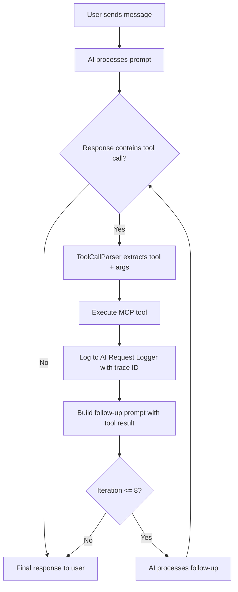
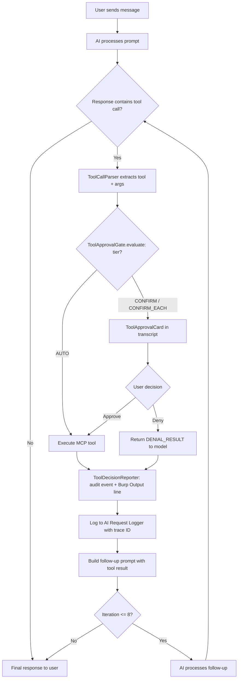

# GitBook Handoff — SC6, out-of-repo half

**Target repository:** `~/Tools/burp-ai-agent-doc` (GitHub: `burp-ai-agent-docs`)
**Published at:** <https://burp-ai-agent.six2dez.com>
**Prepared against:** `3256cc9` (verified clean — `git -C ~/Tools/burp-ai-agent-doc status --porcelain` printed nothing before and after this document was written)
**Prepared by:** phase 26 plan 05, on 2026-08-22

---

## Why this is a handoff and not a commit

`burp-ai-agent-docs` is a **separate git repository**. It is not this repository's `docs/` directory,
and no plan in this phase can commit to it or push it. Writing there from an automated phase would be
an unrequested side effect in a repository this phase does not own, so the honest shape is a prepared
diff handed to you.

**Nothing under `~/Tools/burp-ai-agent-doc` has been modified.** The executor read those files to quote
them and wrote nothing. You apply the diff and push it yourself.

## What motivates each change

Two classes of defect, both landed in this repository in phase 26 plan 05:

1. **Absolute at-rest claims.** `SecretCipher` encrypts stored secrets with AES-256-GCM under a
   per-install random master key — and stores that master key in Burp Preferences, Base64-encoded,
   beside the ciphertext (`SecretCipher.MASTER_KEY_PREF_KEY` = `secret.master.key.v1`). The
   encryption therefore defends against casual inspection of a preferences file or an export, **not**
   against a local attacker who can read those preferences. The site states the guarantee without the
   caveat on three pages.
2. **"Auto Tool Chaining" described with no confirmation gate.** The SEC-06 gate shipped in phase 22
   (`ToolApprovalGate`, `ToolApprovalCard`, `ToolDecisionReporter`). A model-emitted tool call does
   not reach Burp until the user decides. The site still describes the AI as autonomously chaining up
   to 8 tool calls, with no mention that most of those calls stop and ask.

The wording below **was compared against**, not assumed to match, what this repository now says in
`README.md` (§ Privacy and Security Notes), `SPEC.md` (§6, §9, §10) and `docs/ui-safety-guide.md`
(§ Tool-Call Confirmation). The two accounts agree deliberately — a second, slightly different
account of a security control is worse than one, because each looks authoritative.

**A note on the 8-call ceiling.** It is real (`ChatPanel.MAX_AUTO_TOOL_ITERATIONS = 8`) and should
stay. What is wrong on the site is the word *autonomously*, not the number.

---

## 1. `~/Tools/burp-ai-agent-doc/README.md` — the feature bullet

**Motivated by:** SC6 (confirmation flow documented) · symbol: `ToolApprovalGate.tierFor`

### CURRENT (line 20, verbatim)

```markdown
* **Auto Tool Chaining**: Automatic multi-step MCP tool execution where the AI autonomously chains up to 8 tool calls to complete complex tasks.
```

### REPLACEMENT

```markdown
* **Auto Tool Chaining**: Multi-step MCP tool execution, up to 8 tool calls per interaction. Tool calls the AI emits are gated: only read-only tools with bounded output run without asking, everything else surfaces an approval card in the chat transcript first. See [MCP Security Model](mcp/security-model.md#7-tool-call-confirmation-sec-06).
```

---

## 2. `~/Tools/burp-ai-agent-doc/README.md` — the Key Features table row

**Motivated by:** SC6 · symbol: `ChatPanel.MAX_AUTO_TOOL_ITERATIONS`, `ToolApprovalGate.evaluate`

### CURRENT (line 32, verbatim)

```markdown
| **Auto Tool Chaining** | AI autonomously chains up to 8 MCP tool calls per interaction to complete multi-step tasks. |
```

### REPLACEMENT

```markdown
| **Auto Tool Chaining** | Up to 8 MCP tool calls chained per interaction, each subject to the SEC-06 confirmation gate — silent only for read-only, bounded-output tools. |
```

---

## 3. `~/Tools/burp-ai-agent-doc/developer/data-flow.md` — the chaining flow

**Motivated by:** SC6 · symbols: `ToolApprovalGate.evaluate`, `ToolApprovalOutcome.{Run,Ask,Denied}`,
`ToolDecisionReporter.report`, `ToolApprovalGate.DENIAL_RESULT`

### CURRENT (line 155, verbatim)

```markdown
When the AI needs to call MCP tools to answer a user question, tool calls are executed automatically in a loop:
```

### REPLACEMENT

```markdown
When the AI needs to call MCP tools to answer a user question, tool calls run in a loop — but every parsed call passes through the SEC-06 approval gate first (`ToolApprovalGate.evaluate`). Only a tool whose tier is `AUTO` executes with no user decision; `CONFIRM` and `CONFIRM_EACH` park the call and render an approval card in the transcript until the user resolves it. A denial returns a neutral "not authorised, do not retry" result to the model, not an error, and the chain continues without that tool:
```

### CURRENT (the mermaid block immediately under it, verbatim)

````markdown

````

### REPLACEMENT

````markdown

````

---

## 4. `~/Tools/burp-ai-agent-doc/mcp/security-model.md` — a new confirmation section

**Motivated by:** SC6 · symbols: `SecTier`, `ToolApprovalGate.tierFor`, `ToolApprovalGate.resolve`,
`ToolApprovalMemory`, `ChatPanel.clearChatState`, `ToolApprovalCard`

This page is where the flow belongs on the site. It currently documents tool gating on **one** axis
(§3, "Safe vs Unsafe"), which is now half the picture.

### 4a. CURRENT (lines 15-22, verbatim)

```markdown
## 3. Tool Gating (Safe vs Unsafe)

* **Safe tools**: read-only operations, enabled by default.
* **Unsafe tools**: state/traffic modifying operations, disabled by default.


Unsafe tools can modify Burp state and generate outbound traffic. Enable only when needed and only for trusted clients.

```

### 4a. REPLACEMENT

```markdown
## 3. Tool Gating (Safe vs Unsafe)

* **Safe tools**: read-only operations, enabled by default.
* **Unsafe tools**: state/traffic modifying operations, disabled by default.


Unsafe tools can modify Burp state and generate outbound traffic. Enable only when needed and only for trusted clients.


This is a **capability** switch — whether a tool may ever run at all. It is independent of the SEC-06
confirmation tier in §7, which decides whether the extension's own AI may run a tool *without asking
you*. Neither is derivable from the other: `ai_analyze` and `ai_passive_scan` ask on every call
without being unsafe tools at all.
```

### 4b. ADDITION — new section, appended after §6 "TLS (Optional)" and before end of file

Anchor: it goes immediately after the line
`This implementation works on JDK 8 through JDK 25+ without additional dependencies.`

```markdown

## 7. Tool-Call Confirmation (SEC-06)

§1-§6 govern what an **external MCP client** can reach. This section governs something different:
what the extension's **own AI** may do when it emits a tool call in its response text. Those calls
originate with the model, not with you, so they carry their own trust boundary.

A tool call parsed out of model output does not execute against Burp until you decide. Every tool
carries a required security tier:

| Tier | Behaviour |
| :--- | :--- |
| `AUTO` | Runs with no user decision. Requires read-only **and** bounded output. |
| `CONFIRM` | Asks, and offers **Approve for session** — scoped to the current chat. |
| `CONFIRM_EACH` | Asks on every single call. No session memory in either direction. |

**Resolution fails closed.** A tool name the catalog does not recognise resolves to `CONFIRM_EACH`,
never to `AUTO`. Every `ext:`-namespaced external tool resolves to `CONFIRM_EACH` before the catalog
is consulted at all, so an external tool can never inherit a built-in tool's silent tier.

**Read-only is not sufficient for `AUTO`.** `proxy_http_history`, `site_map` and `scanner_issues` are
read-only yet ask, because what they return is bulk attacker-controlled traffic entering model
context.

**The prompt is a card in the chat transcript, not a modal dialog.** It names the tool, shows the
arguments the model supplied, and offers **Approve once**, **Approve for session**, **Deny** and
**Deny for session**. Arguments are truncated for display only — the full arguments are sent if you
approve.

**Session approvals are narrow and impermanent.** They are scoped to one chat session, discarded by
**Clear Chat** and by starting a new session, and held in memory only — restarting Burp, reloading
the extension or switching Burp project all clear them.

**Denying is not an error.** The model receives a neutral "this tool call was not authorised, do not
retry it, continue with the information you already have" result, so it does not treat the refusal as
a malfunction to work around.

**Every decision is recorded** — including automatic runs and denials — as an audit event plus a line
in Burp's **Output** tab. Audit logging is off by default, so the Output line is the record most
users see.
```

---

## 5. `~/Tools/burp-ai-agent-doc/privacy/limitations.md` — the `SecretCipher` caveat

**Motivated by:** SC6 / QUAL-07 · symbols: `SecretCipher`, `SecretCipher.MASTER_KEY_PREF_KEY`

This page is the site's honest-limitations page, which makes it the right home for the caveat.

### ADDITION — new section, inserted between `## Model-Specific Considerations` and `## Responsible Use`

Anchor: after the model-comparison table row ending
`| **Code-focused models** (CodeLlama, DeepSeek Coder) | Good at JS/code analysis. | May struggle with non-code security concepts. |`
and before the line `## Responsible Use`.

```markdown

## Secrets at Rest — What the Encryption Does Not Do

Stored API keys and tokens are encrypted with AES-256-GCM under a per-install random master key
(`SecretCipher`). **That master key is itself stored in Burp Preferences, Base64-encoded, beside the
ciphertext it protects** (preference `secret.master.key.v1`).

Anyone who can read your Burp Preferences can therefore also read the key and decrypt the secrets. It
does **not** protect against a local attacker or a malicious process running as your user; treat it
as obfuscation against casual inspection of a preferences file or an exported project.

**Mitigation**: if a credential must survive a local-attacker threat model, keep it in a dedicated
secret store and paste it per session rather than saving it in extension settings. Treat
preference-file access as equivalent to credential access.
```

---

## 6. `~/Tools/burp-ai-agent-doc/backends/anthropic.md` — three at-rest claims

**Motivated by:** SC6 / QUAL-07 · symbol: `SecretCipher.MASTER_KEY_PREF_KEY`

### 6a. CURRENT (line 12, verbatim)

```markdown
2. Enter your **API key**. It is encrypted at rest (AES-256-GCM, `ENC1:`-prefixed) and never written to logs or exported settings.
```

### 6a. REPLACEMENT

```markdown
2. Enter your **API key**. It is encrypted at rest (AES-256-GCM, `ENC1:`-prefixed) and never written to logs or exported settings — see [Encrypted key](#notes) below for what that encryption does and does not protect against.
```

### 6b. CURRENT (line 21, verbatim)

```markdown
| **Anthropic API Key** | `sk-ant-…` (stored AES-256-GCM encrypted) |
```

### 6b. REPLACEMENT

```markdown
| **Anthropic API Key** | `sk-ant-…` (stored AES-256-GCM encrypted; master key is in Burp Preferences too — see Notes) |
```

### 6c. CURRENT (line 30, verbatim)

```markdown
* **Encrypted key.** The API key is encrypted with a per-install master key; the plaintext value never appears in logs or exported settings.
```

### 6c. REPLACEMENT

```markdown
* **Encrypted key.** The API key is encrypted with a per-install master key and the plaintext value never appears in logs or exported settings. **The master key is itself stored in Burp Preferences, Base64-encoded, beside the ciphertext** (preference `secret.master.key.v1`), so this protects against casual inspection of a preferences file or an export — not against a local attacker who can read those preferences. See [Secrets at Rest](../privacy/limitations.md#secrets-at-rest--what-the-encryption-does-not-do).
```

---

## 7. `~/Tools/burp-ai-agent-doc/mcp/external-servers.md` — the at-rest claim

**Motivated by:** SC6 / QUAL-07 · symbols: `SecretCipher.MASTER_KEY_PREF_KEY`,
`ToolApprovalGate.tierFor` (the `ext:` short-circuit)

### 7a. CURRENT (line 26, verbatim)

```markdown
* **Encrypted auth tokens.** SSE bearer tokens are stored encrypted at rest (AES-256-GCM, `ENC1:`-prefixed) — the same path as every other API key — masked in the UI behind a show/hide toggle, and never logged.
```

### 7a. REPLACEMENT

```markdown
* **Encrypted auth tokens.** SSE bearer tokens are stored encrypted at rest (AES-256-GCM, `ENC1:`-prefixed) — the same path as every other API key — masked in the UI behind a show/hide toggle, and never logged. The AES master key is itself stored in Burp Preferences beside the ciphertext (`secret.master.key.v1`), so this protects against casual inspection of a preferences file, not against a local attacker. See [Secrets at Rest](../privacy/limitations.md#secrets-at-rest--what-the-encryption-does-not-do).
```

### 7b. ADDITION — one bullet, appended to the same `## Security Model` list

Anchor: after the existing `* **Audit logging.**` bullet.

```markdown
* **Always confirmed.** When the extension's own AI emits a call to an `ext:`-namespaced tool, it asks you every single time — no "approve for session" option. External tools never inherit a built-in tool's silent tier. See [Tool-Call Confirmation](security-model.md#7-tool-call-confirmation-sec-06).
```

---

## No `SUMMARY.md` change needed

Every change above is an edit or an in-page addition. No new page is proposed, so the site's table of
contents (`~/Tools/burp-ai-agent-doc/SUMMARY.md`) does not need touching.

---

## How to apply

```bash
cd ~/Tools/burp-ai-agent-doc

# 1. Confirm you are starting from what this diff was prepared against.
git status --porcelain          # expect: no output
git rev-parse --short HEAD      # expect: 3256cc9 (later is fine — re-check the CURRENT quotes)

# 2. Apply each section above by hand, confirming the quoted CURRENT text
#    still matches what is on disk at the named path before replacing it.

# 3. Review.
git diff

# 4. Commit and push. The site builds from this repository, so it is live once pushed.
git add -A
git commit -m "docs: correct at-rest claims and document the SEC-06 tool-call confirmation gate"
git push
```

## Coverage checklist

| # | Page | Change | Applied? |
| :-- | :--- | :--- | :--- |
| 1 | `README.md` | Auto Tool Chaining bullet | ☐ |
| 2 | `README.md` | Auto Tool Chaining table row | ☐ |
| 3 | `developer/data-flow.md` | Loop sentence + mermaid | ☐ |
| 4 | `mcp/security-model.md` | §3 amendment + new §7 | ☐ |
| 5 | `privacy/limitations.md` | Secrets-at-rest section | ☐ |
| 6 | `backends/anthropic.md` | Three at-rest claims | ☐ |
| 7 | `mcp/external-servers.md` | At-rest claim + `ext:` bullet | ☐ |
